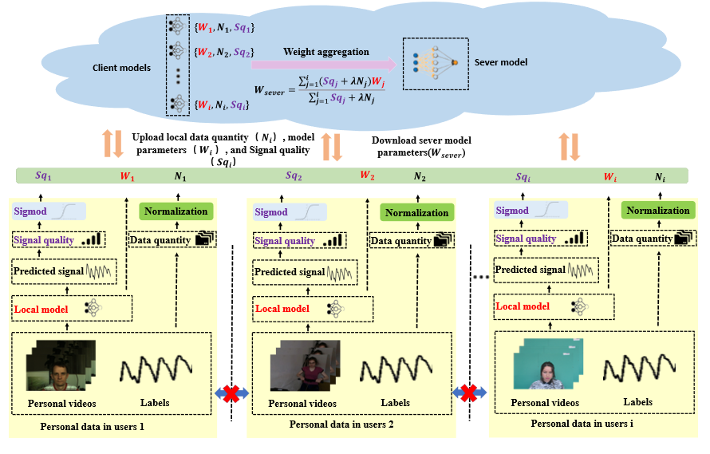

# FedSQ2
Code of A Robust rPPG Federated Learning Framework Against Motion Interference Data

## Running environment:
python=3.6, pytorch-gpu=1.10.2,opencv-python=4.40,wandb=0.13.1,tqdm=4.46

## Architecture of FedSQ2


## To start: 
```bash
  python FedSD.py 
```

